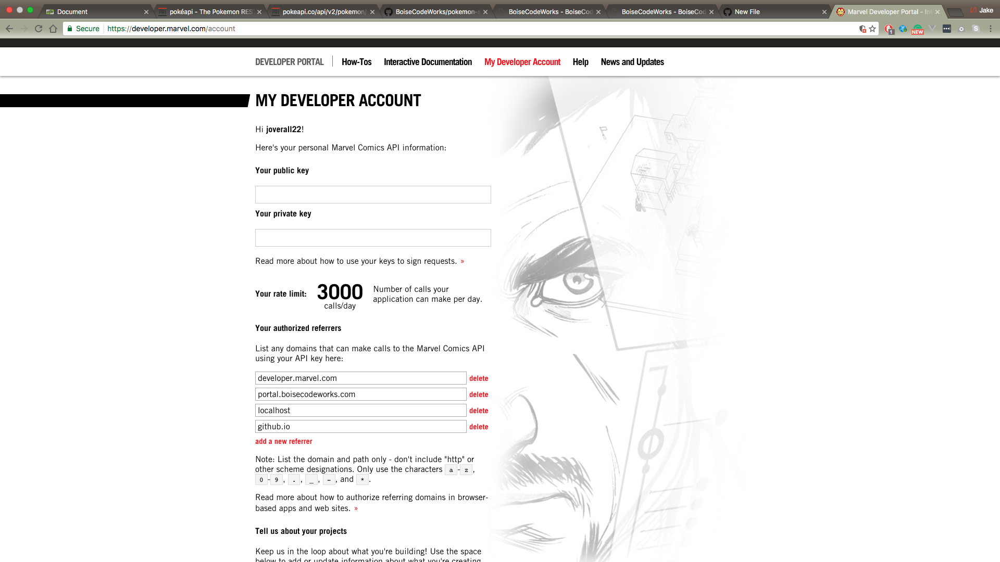

# marvel-trading-cards

Let's put together an application that allows users to create their dreamteam of superheroes.


For this challenge you will be working with data from the Marvel Api. The Marvel api requires a key when requesting data so you are going to need to register for one of your own.

[Request your key](https://marvel.com/signin)

Once you sign in and authenticate your account with the confirmation email you should see a page similar to this




To make requests to the marvel api you will need to use your public key by appending it to the end of your api query.


```javascript

const key = '?apikey=YOURPUBLICKEYHERE';
const baseUrl = 'http://gateway.marvel.com/v1/public/'

function getMarvel(query, cb){
  $.get(baseUrl + query + key).then(cb)
}
```


###Adding Heroes

Once you are getting the marvel data its now time to start adding heroes to your own team. Once a hero has been added to the user team he or she should be removed from the `marvel-list` and only show up on the `my-characters` section of the page.

A user should be able to remove heroes from their team and have them added back to the `marvel-characters` section. 

Once you get the two lists working try adding some bonus features 

- limit the number of heroes to 6
- Add functionality to create additional lists that could hold up to 6 heroes
- A hero should only be on one list at any given time


